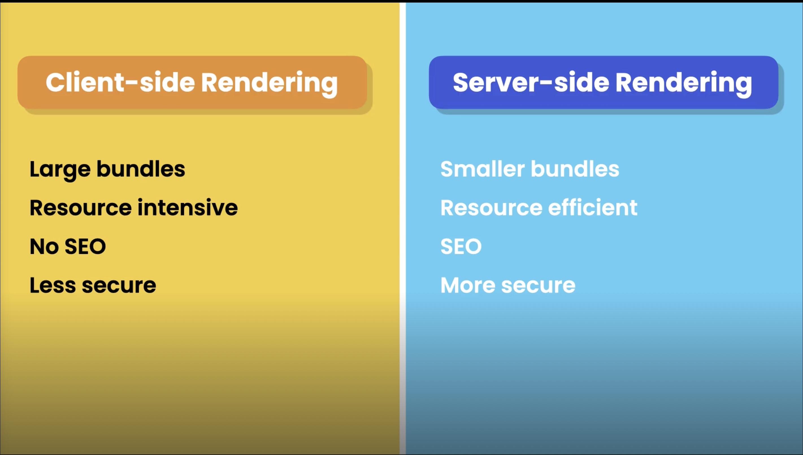
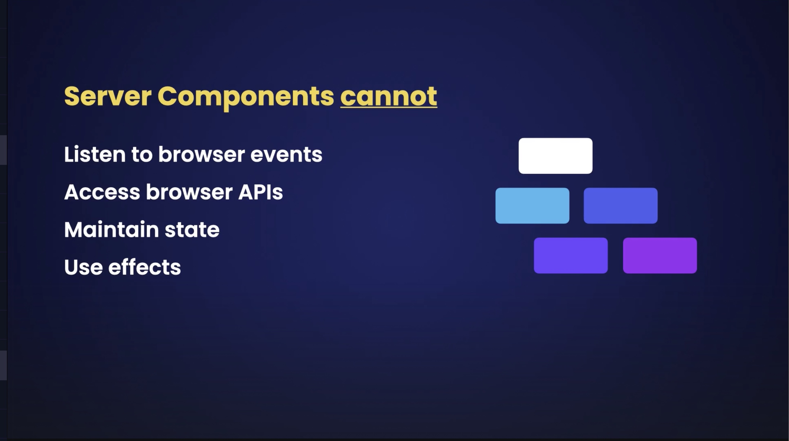
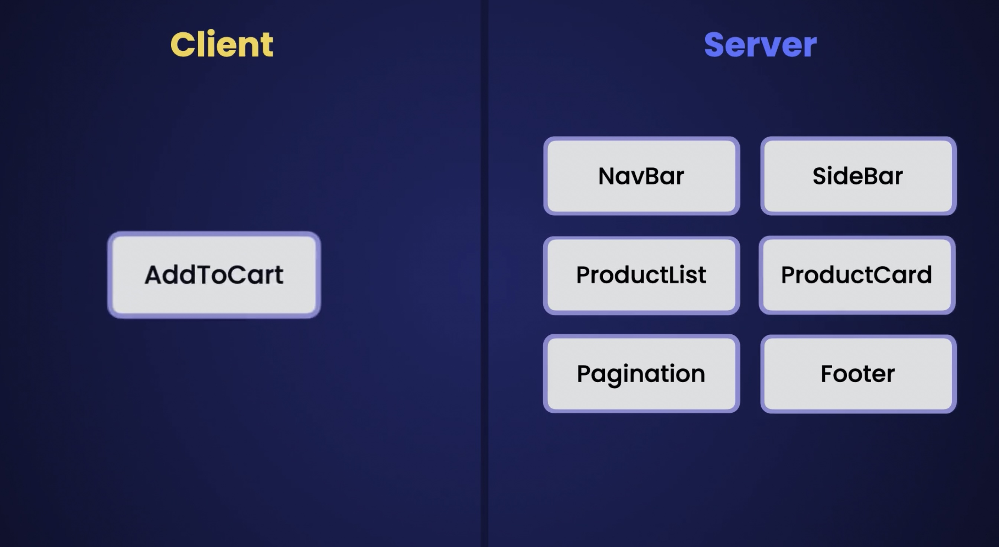
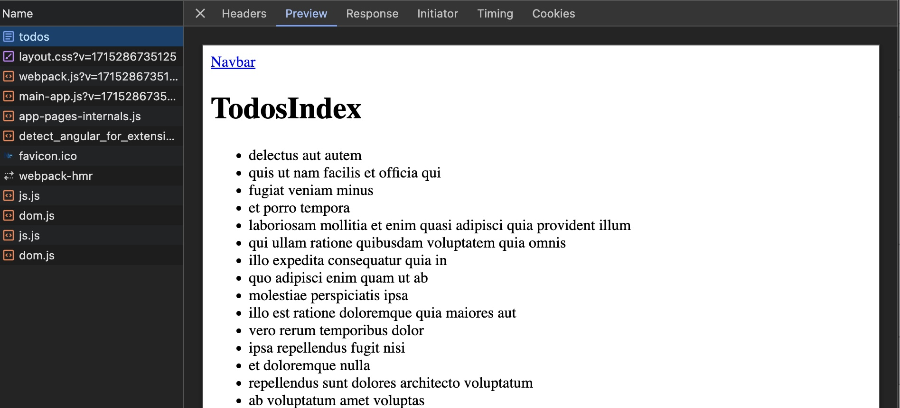
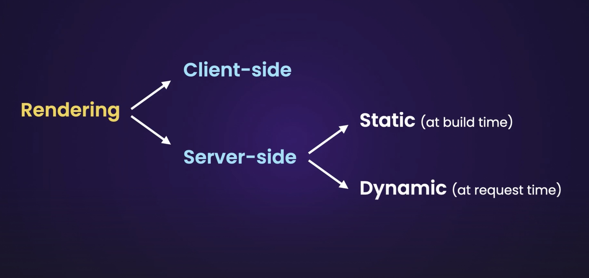
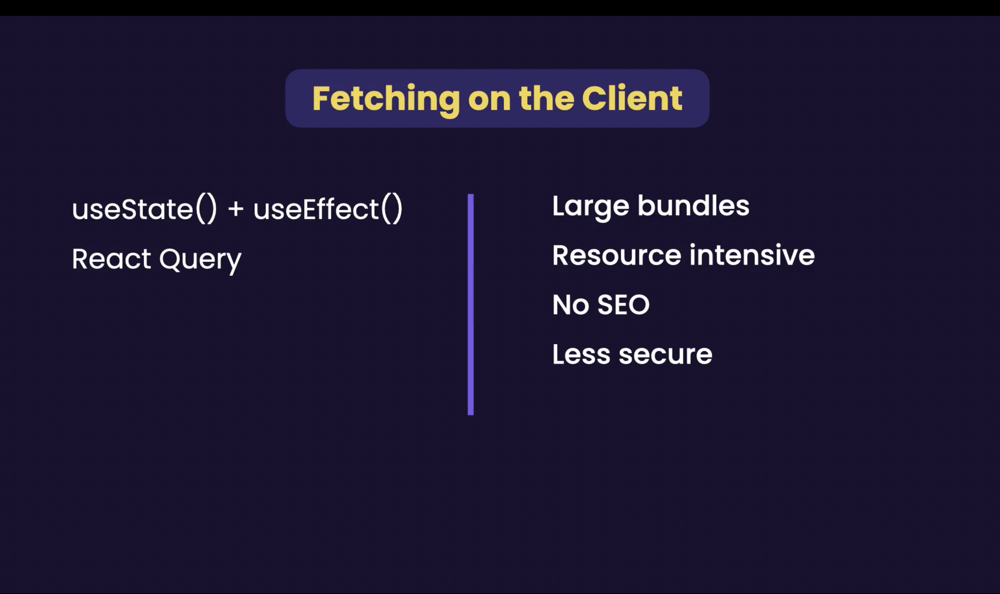

# Pros and Cons of Server-Side Rendering (SSR)

Server-side rendering (SSR) is a popular technique in web development, especially with frameworks like Next.js that make it relatively easy to implement. Let's delve into the pros and cons of using SSR, based on the concepts discussed in the provided screenshots.





### Pros of SSR

1. **SEO Friendly**: SSR provides a significant SEO advantage since the server sends a fully rendered page to the client, making it easier for search engine bots to crawl and index the content. This is especially important for content-heavy sites.

2. **Faster Initial Page Load**: Users see the fully rendered HTML before any JavaScript is downloaded and executed. This can lead to a better user experience, especially on slower networks or devices.

3. **Smaller Initial Bundle**: Since the server does the heavy lifting, the initial load doesn't need to include all the scripts required for client-side rendering, which can result in faster performance initially.

4. **Resource Efficiency**: By handling much of the processing on the server, SSR can offload work from client devices, which may be beneficial for users with less powerful devices.

### Cons of SSR


1. **Resource Intensive on Server**: SSR can be more demanding on server resources, as the server must render content for each request, which might not be ideal for very high traffic sites without proper scaling solutions.

2. **Complexity in Development**: Managing an application using SSR can introduce complexity in the development process, requiring developers to handle state management, routing, and API interactions differently than in a purely client-side rendered app.

3. **Longer Time to Interactive**: Although the content is visible sooner, the JavaScript needed for interactivity may take longer to execute once it arrives. This can lead to a delay in interactive elements becoming usable.

### Limitations of Server Components in SSR




- **Cannot Listen to Browser Events**: Server components do not have access to browser-specific events because they are rendered on the server before reaching the client.

- **No Access to Browser APIs**: Server components cannot directly access browser APIs such as the DOM or local storage because these APIs require a browser context.

- **Cannot Maintain State or Use Effects**: Unlike client-side components, server components do not maintain state across renders and cannot utilize React lifecycle methods or hooks like `useEffect`, which are only executed on the client.


SSR offers advantages in speed, SEO, and efficiency, making it ideal for static sites and applications where first contentful paint (FCP) and SEO are priorities. However, it comes with drawbacks in server load, architectural complexity, and limitations in dynamic features and interactivity that depend on client-side JavaScript.

Deciding whether to use SSR should be based on specific project requirements, traffic expectations, and the need for SEO versus interactive features.

### Use case scenario

Let's say we want to build this users page:


we want to keep all the components on `ssr` but the `btn` component for open a modal with user details.



> Server components render on the server, improving performance by reducing the JavaScript load on the client. However, this model restricts passing functions, such as event handlers, from the server to the client directly, which can limit interactivity.

In this way we can still listen for the click event on the `btn`:

```
'use client';

/* eslint-disable @typescript-eslint/no-explicit-any */
import React from 'react';
import Button, { IBtn } from '../../../library/button';
import { IUser } from '../interfaces';

interface IEvent {
    eventName: string;
    data: any;
}

type Props = IBtn & IEvent;

const BtnHydrated = ({ label, data, eventName }: Props) => {
    const handleClick = () => {
        if (eventName === 'openModal') {
            const current = data as IUser;
            console.log('openModal', current);
        }
    };
    return <Button label={label} onEmitEvent={handleClick} />;
};

export default BtnHydrated;


```

# Caching in Next.js: A Practical Guide to Effective Data Management

Welcome to a simplified guide on leveraging Next.js' built-in caching capabilities to enhance application performance. Next.js automatically handles caching of data fetched during server-side rendering, making it easier to manage data efficiently with minimal configuration. Let's dive into the fundamentals of caching in Next.js, using the JSONPlaceholder API for demonstration.

## Understanding Data Sources and Automatic Caching in Next.js

Next.js applications benefit from the framework's automatic handling of caching during server-side operations. When data is fetched, Next.js smartly caches the response, thereby improving response times and reducing server load for subsequent requests.

### Implementing Basic Fetch with Default Caching

Here's how a simple data fetch operation is typically set up in a Next.js application:

```tsx
const UsersPage = async () => {
  const res = await fetch('https://jsonplaceholder.typicode.com/users');
  const users = await res.json();

  return (
    <div>
      <h1>Users</h1>
      <ul>
        {users.map(user => (
          <li key={user.id}>{user.name}</li>
        ))}
      </ul>
    </div>
  );
};
```

In this example, the fetch API is used without specifying any cache options. By default, Next.js will cache this data fetched during server-side rendering. This default behavior ensures that your application loads quickly and reduces the load on your backend services.




### Using Custom Caching Strategies in Next.js

While Next.js provides sensible defaults, you might encounter situations where more control over caching is necessary. For instance, if you need to ensure that your data is always fresh or if you wish to cache data for a specific duration, you can specify this in the fetch options:

```tsx
const UsersPage = async () => {
  const res = await fetch('https://jsonplaceholder.typicode.com/users', {
    cache: 'no-store'  // Forces the request to bypass the cache, ensuring fresh data
  });
  const users = await res.json();

  return (
    <div>
      <h1>Users</h1>
      <ul>
        {users.map(user => (
          <li key={user.id}>{user.name}</li>
        ))}
      </ul>
    </div>
  );
};
```

Alternatively, for data that changes infrequently and where slight staleness is acceptable, setting a revalidation strategy can optimize performance:

```tsx
const UsersPage = async () => {
  const res = await fetch('https://jsonplaceholder.typicode.com/users', {
    next: { revalidate: 10 } // Caches the data and checks for updates every 10 seconds
  });
  const users = await res.json();

  return (
    <div>
      <h1>Users</h1>
      <ul>
        {users.map(user => (
          <li key={user.id}>{user.name}</li>
        ))}
      </ul>
    </div>
  );
};
```

## Static vs Dynamic Rendering in Next.js




Understanding the differences between static and dynamic rendering is crucial for optimizing your Next.js application's performance:

- **Static Rendering (at build time):** Pages are generated at build time and served as static HTML. This approach is highly efficient for pages that do not require real-time data. Next.js can cache these pages until the content changes, which you can specify with revalidation parameters.

- **Dynamic Rendering (at request time):** Pages are rendered on each request, useful for content that changes frequently and needs to be up-to-date. While caching is still possible, it should be handled thoughtfully to balance between data freshness and response speed.

- **Client-side Rendering:** After the initial loading of the HTML, the client-side takes over, and JavaScript manages subsequent UI updates. This method can be combined with static or server-side rendering to enhance interactivity and load data dynamically as needed.

This diagram illustrates the relationship between different rendering methods and when to use each:


## Considerations for Client-Side Fetching




- **Bundle Size**: Incorporating client-side data fetching often leads to an increased JavaScript bundle size due to the inclusion of additional libraries and scripts required to manage data interactions and state. This can affect the load time and performance of your application, especially on slower connections.

- **Resource Intensive**: Executing data fetching directly in the client's browser leverages the user’s device processing power. This can be resource-intensive, particularly for devices with limited capabilities or when dealing with large datasets or complex operations.

- **SEO Impact**: Client-side data fetching does not populate content during the server-side rendering process. This means that content fetched from APIs post-initial render will not be visible to search engines during their crawling process, which could negatively affect your application's search engine rankings.

- **Security**: Storing and using API keys or making API requests directly from client-side code exposes your application to potential security vulnerabilities. It is crucial to ensure that sensitive data and operations are protected and that appropriate security measures, such as API endpoint protection and robust authentication practices, are in place.